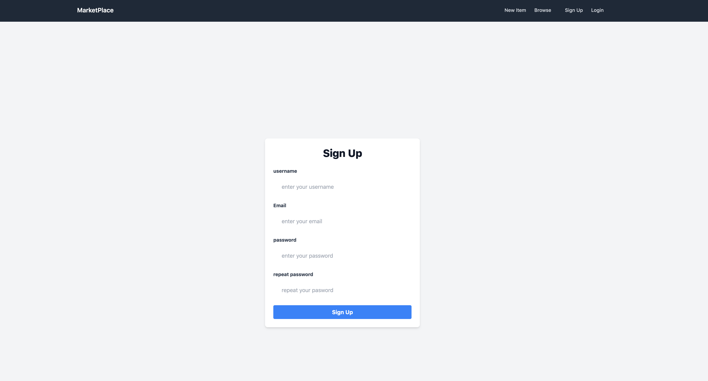
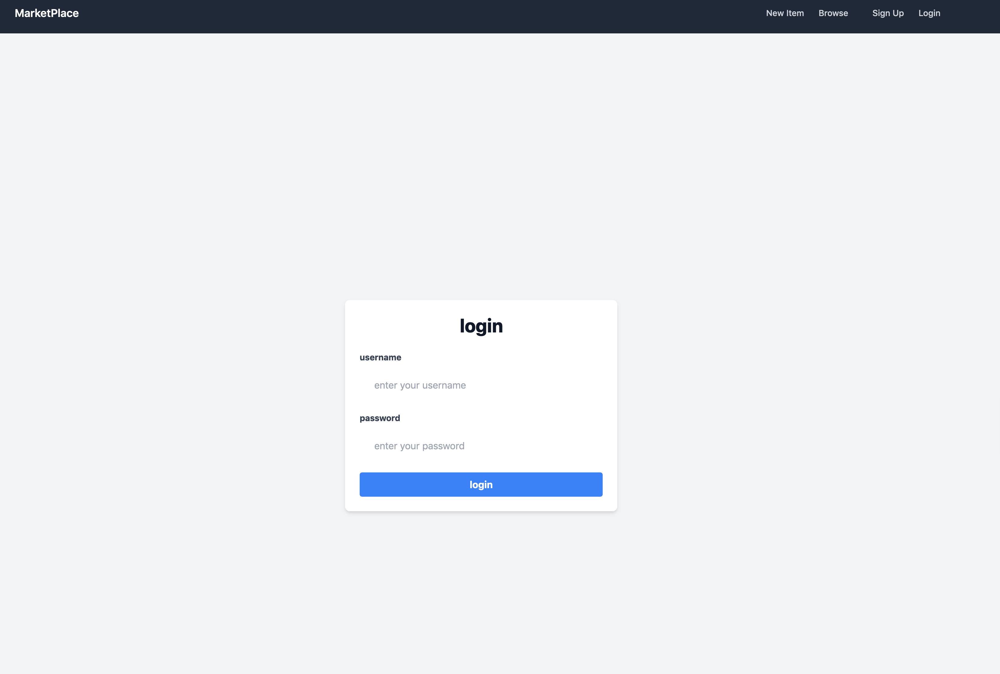

# MyMarketplace

## Overview

MyMarketplace is a web-based platform built with Django and TailwindCSS, designed for buying and selling products. Users can sign up, log in, list products, browse and view product details, contact sellers, and maintain a personalized inbox for communications related to items.

## Features

- **User Authentication:** Secure login and signup functionality for users.
- **Product Listing:** Registered users can list products for sale, providing details and images.
- **Browse Products:** All visitors can browse listed products, filtered by various categories.
- **Product Details:** View detailed information about products, including seller contact info.
- **Contact Seller:** Users can contact the seller directly from the product details page.
- **User Inbox:** Each user has a personal inbox for receiving and managing communications.

## Installation

1. **Clone the Repository:**

2. **Set Up a Virtual Environment:**

3. **Install Dependencies:**
   django,Pillow

4. **Run the Development Server:**
	python manage.py runserver 0.0.0.0:8000

## Usage

- **Access the Website:**
Open a web browser and go to `http://localhost:8000` to view the application.

- **Admin Panel:**
Access the Django admin panel at `http://localhost:8000/admin` to manage users, products, and other data.

## Screenshots

Below are some screenshots showcasing the key features of MyMarketplace:

